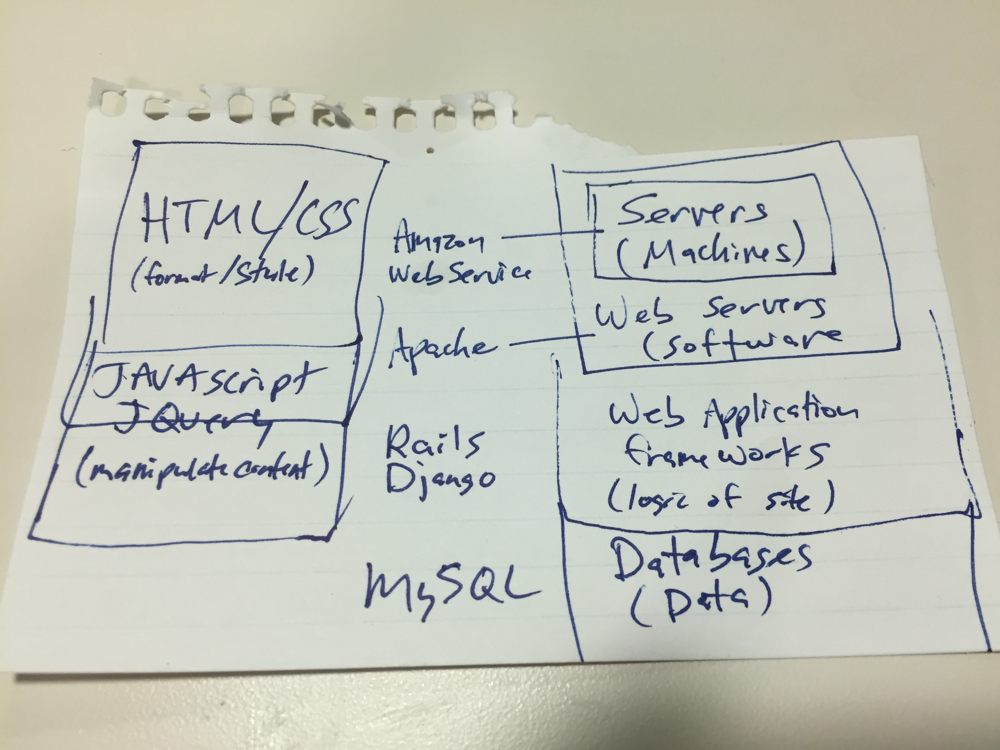

A year ago, with no programming experience, I set out to learn [Cold Fusion](http://www.adobe.com/products/coldfusion-family.html).  At work, I was responsible for a report that pulled data that people across the organization updated on the web. I decided to fix the form and change some of the fields. I thought it would be no big deal for me to make these updates myself, but the developer in my organization looked at me and said, “Sure you can make the changes yourself—you just have to learn [Cold Fusion](http://www.adobe.com/products/coldfusion-family.html).”  I hadn’t programmed before, but I’d built a few Access databases, so I decided to give it a shot.  After two frustrating days full of failed installation and configuration attempts, I was able to start on the [Learn CF in a Week](http://www.learncfinaweek.com/) tutorial.  I don’t think our developer expected me to take him up on the offer, but I was back the next week to let him know I was working on learning it.  That initiative kind of fizzled when I wasn’t able to get a software license for an [IDE](https://en.wikipedia.org/wiki/Integrated_development_environment) (which I had to look up) on my work computer, but a seed had been planted.

I spent the next week learning how the web works and emerged from my studies with this sketch and a desire to learn web development in 2016.



I did some research on programming languages for a beginner to learn and settled on [Ruby](https://www.ruby-lang.org/en/) and [Rails](http://rubyonrails.org/).  But before I jumped right into [Ruby](https://www.ruby-lang.org/en/) , I spent a week or two learning [HTML](http://www.w3schools.com/html/), [CSS](http://www.w3schools.com/css/), and [JavaScript](https://www.javascript.com/) through [Code School](https://www.codeschool.com/).  Once I had a basic understanding of those, I began with [Learn Ruby the Hard Way](https://learnrubythehardway.org/book/) and shortly thereafter started the [Ruby on Rails Tutorial](https://www.railstutorial.org/book).  [Learn Ruby the Hard Way](https://learnrubythehardway.org/book/) gave me the foundation to understand what was going on in my code, but the [Ruby on Rails Tutorial](https://www.railstutorial.org/book) got me hooked...within 15-20 minutes I had deployed a “[Hello World](https://en.wikipedia.org/wiki/%22Hello,_World!%22_program)” app to the internet!!

So what was I going to do with all this newfound knowledge and excitement?  A few years ago, my friends created a Fantasy Sports League with unique rules they call The 338 Challenge.  Instead of picking players, you pick teams (or individuals in sports like golf).  If your team wins the championship or places in the top 8 you get points.  There are 14 different sports leagues, ranging all the way from the NFL to the Kentucky Derby.  Since the league started, it has grown to 28 teams, split into 2 divisions.  Before me and my big coding dreams came along, the Commissioner kept track of all the data with spreadsheets, all communication was done via email, and he updated the HTML website by hand.  Once he learned I was learning programming, he asked if I could help him make a new website.  So in February I started playing around to see if this website was something I could possibly do.  The good news was the next season didn't start until August so I had about 6 months to get it together.  Now I had a real project!

So I dove into the process, spending my time either building out the Fantasy Sports website or learning more about Ruby, Rails, and programming in general.  About six weeks later, my Fantasy Sports League website could probably be considered a minimal viable product ([MVP](https://en.wikipedia.org/wiki/Minimum_viable_product)).  About that time, I started getting serious about learning testing.  I first read about testing in Learn Ruby the Hard Way [Exercise 47: Automated Testing](https://learnrubythehardway.org/book/ex47.html) , and it made no sense to me.  The [Ruby on Rails Tutorial](https://www.railstutorial.org/book) did a good job of introducing the concept, but the idea of testing didn’t really click until I started making my real app.  Things would break as I added new features or tried to improve my code with better design or style, so I had to click through my site to make sure things were still working.  I probably did this 100 times until I realized it would be much easier to write automated tests rather than clicking around after every change. One I had a better grasp on testing, I quickly realized my MVP with no tests was not going to work.  

So in April, I started rebuilding the app using [Test Driven Development](https://en.wikipedia.org/wiki/Test-driven_development) to the best of my (not-so-great) ability.  It didn’t go too bad because I had already figured out much of the overall design and architecture of the web app.  By early June, [The 338 Challenge](https://github.com/axelclark/the-338-challenge), had much better test coverage and had more features than my earlier MVP.

I’m learning programming as a hobby and don’t intend to change careers any time soon, so I have some flexibility to learn and explore whatever I find interesting.  I began hearing a lot about [Elixir](http://elixir-lang.org/), so I decided to start playing around with it.  Its syntax is similar to [Ruby](https://www.ruby-lang.org/en/), so it wasn’t as intimidating as some of the other langauges I was checking out, e.g. [Go](https://golang.org/) or [Haskell](https://www.haskell.org/).  I was even considering rebuilding my app in Elixir and was convinced when I heard a [Bike Shed](http://bikeshed.fm/) episode titled [You’re an Elixir Developer Now](http://bikeshed.fm/52).  The Bike Shed is my favorite programming podcast.  Sean Griffin ([@sgrif](https://twitter.com/sgrif)) and Derek Prior ([@derekprior](https://twitter.com/derekprior)) are really fun hosts and I use the podcast to become more familiar with more advanced programming issues.  In this episode, Derek mentioned he was loving Elixir and would probably build any new [green field project](https://en.wikipedia.org/wiki/Greenfield_project) in [Elixir](http://elixir-lang.org/) and [Phoenix](http://www.phoenixframework.org/). So I said, “Why not?”, and set out on the challenge of learning Elixir and Phoenix.  I started my new Elixir app ex338, [https://github.com/axelclark/ex338](https://github.com/axelclark/ex338), in early July.  

By mid August, I had built the app a third time and had features in place for the site to be essentially a static site to the user, with admin pages for the commissioner to update information in the database. I built a login functionality, but the users still had to email in their draft picks. About a week before the draft, the commissioner and I were talking and he asked if I could add a feature to let users draft through the site. I had no plans to implement this feature until my buddy mentioned it, but I got to work immediately and was able to put it in place before the draft. It was a hit with the users! Since then, we’ve added features to add and process waivers (adding a team or player that is currently unowned) and have worked out a couple of other small bugs. I’ve learned a ton about the issues you face when real users interface with an app.
  
For the first 9 months, I put off learning [JavaScript](https://www.javascript.com/), but then I ran into a problem where JavaScript was going to be the best solution...filtering drop down options for making a draft pick.  In my initial [ex338](https://github.com/axelclark/ex338) implementation, the drop down to select a draft pick had every possible team and player (about 450 options.)  This was really clunky and a pain to scroll through, especially on mobile.  After a little bit of research, I realized the filter was best done in the browser, so I set out to learn JavaScript.  (This programming thing is a slippery slope!)  Here is my first JavaScript code (it also needed to add classes to the options), relying heavily on [jQuery](https://jquery.com/).
```javascript
var $ = require('jquery');

$(document).ready(function() {
  
  $('.players-to-filter').find("option").each(function(){
    var txt = $(this).text();
    var player_array = txt.split(" ");
    var league = player_array[player_array.length -1];
    $(this).addClass(league);
  });
  
  var allOptions = $('.players-to-filter option');

  $('.sports-select-filter').change(function () {
    $('.players-to-filter option').remove()
    var sportsLeague = $('.sports-select-filter option:selected').prop('text');
    var opts = allOptions.filter('.' + sportsLeague);
    $.each(opts, function (i, j) {
      $(j).appendTo('.players-to-filter');
    });

    $('.players-to-filter option:eq(0)').prop('selected', true);
  });
});
```
Now it looks relatively simple, but that took me hours to figure out! But at least the users really appreciated the change when I updated the site.

This fall, I was reading a lot about Elixir and Phoenix as a JSON API (e.g. “[Building and testing a Phoenix JSON API](“https://robots.thoughtbot.com/building-a-phoenix-json-api)") for a JavaScript frontend (e.g. [React](https://facebook.github.io/react/), [Angular](https://angular.io/), [Elm](http://elm-lang.org/)).  Like I mentioned before, I had avoided JavaScript because I wasn’t ready to dive into it yet.  However, after my time spent learning JavaScript basics to implement my filter, I decided to check out one of these frontends.  I decided to learn [React](https://facebook.github.io/react/) and eventually completed the [Redux Tutorial](http://redux.js.org/) and most of [ReactJS Redux, the Right Way](https://reactjs.co/#basic-preface).  

My buddy Matt is learning JavaScript too, so we were excited to try working together on a project.  Starting off, I had no idea how JavaScript called APIs on the web to get data, i.e. how the frontend and backend linked up.  So I took some time researching how that worked and suggested we build an app that provides the expected arrival times of Metro trains in DC (partially inspired by the Bike Shed episode "[Purple Train](http://bikeshed.fm/86)").  Initially I was excited to include a Elixir/Phoenix backend, but soon realized it would be simpler during the beginning just to call the [WMATA developer API](https://developer.wmata.com/docs/services) directly from the browser.  Currently we have a very bare bones implementation, [https://github.com/WojoSite/metroApp](https://github.com/WojoSite/metroApp) and deployed to [https://wmata-metro-app.herokuapp.com/](https://wmata-metro-app.herokuapp.com/), which we are using to learn React and Redux fundamentals.  It is built using [Create React App](https://github.com/facebookincubator/create-react-app/blob/master/packages/react-scripts/template/README.md) which is a great tool to get a project started easily.

Finally, as I was learning React fundamentals, I came across [Gatsby](https://github.com/gatsbyjs/gatsby) which uses React to build static sites.  I started playing around with it and built a simple blog site, [https://github.com/axelclark/axelclark.com](https://github.com/axelclark/axelclark.com).  Unfortunately, I had a blog, but no content so I decided to write a blog post about my year learning programming and here it is!

Well there you have it, a year learning programming.  If you have any questions, you can find me on Twitter at [@axelclark2](https://twitter.com/axelclark2) or Github at [axelclark](https://github.com/axelclark).  My next post will be a collection of notes I made about what worked and didn't work for me.  It will also include a list of my favorite resources.  Thanks for reading!
